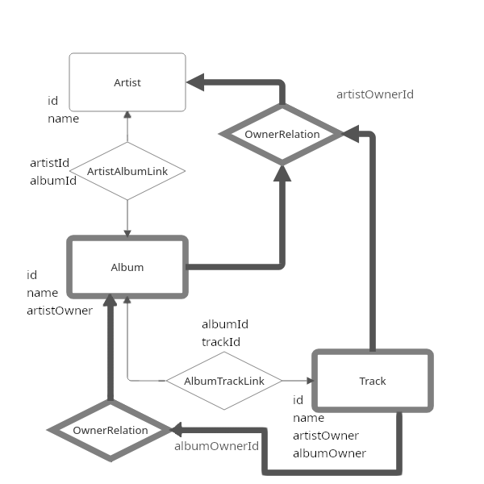

# Databases and Information Systems Group Project

## Introduction
We have built an artist/album/track browser that allows for relation lookups of releases by artists.
We have also implemented an ui for adding new data to the database, and a search that uses regex so find
relevant elements in the database.

Our database tables are set up as outlined in the ERDiagram.png file, linked below.

Our database consists of a number of many-to-many connections, as well as some one-to-one connections.

# Running the web application
## Prerequisite

* Podman or docker

## How to run

### Podman 

Run the following to build and run a clean version of the web-app alongside its database

`podman kube down kube_db.yaml`\
`podman volume rm pgsql-pvc`(If you want to wipe the database)\
`podman play kube kube_db.yaml`

In order to run the web app in kubernetes as well run the following:

`podman kube down kube_total.yaml`\
`podman build -f Podfile -t web-app`\
`podman volume rm pgsql-pvc`(If you want to wipe the database)\
`podman play kube kube_total.yaml`

### Docker

- (possibly start docker socket)
- `docker pull postgres`
- `docker run --name wizard -e POSTGRES_PASSWORD=password -p 5432:5432 -d postgres`
- change the host ip in `.env` to the result of `docker inspect wizard | grep -i ipaddr`

---

Then navigate to:
`http://localhost:5000`

## Using the web application

When entering the website you will be greeted with the home page,
from here you can freely pick a tab at the top of the page.

Testing the app could look like this:
* Go to the [Search Tab](http://localhost:5000/search?q=) and scroll through artists, albums, and tracks.
* Search for one of the artists using the search bar at the top left of the page.
* Click the artist, view the albums they are affiliated with.
* Click an album and check which songs appear on it.
* Click the track, control that the artist and album you entered through are liked to.
* Go to the [Insert Data](http://localhost:5000/linker_select) tab, and try inserting a new artist
* Control that the new artist has been inserted in the [Artists Tab](http://localhost:5000/artists)
* The above two steps can be repeated for other operations such as update and deleate, and/or for other tables. Not that added albums/tracks will now be visible under the artist/album that is set to own them without updating the link tables.
* In the [Insert Table Link Page](http://localhost:5000/linker_select) Try updating the link table to add an album to an artist.
* Test adding an album track link in the same way.

With the above steps executed a full tour of the functionality of the web application is complete.

